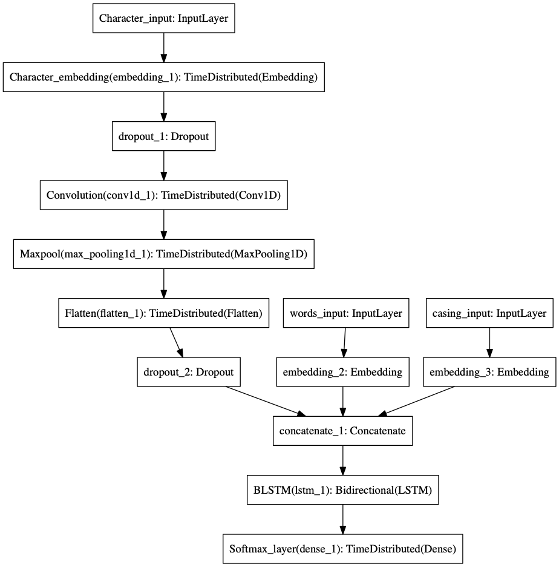

This repo is based on the following paper :

#Few-shot Learning for Named Entity Recognition in Medical Text

paper : **https://arxiv.org/pdf/1811.05468v1.pdf**
---
original implementation for reference : **https://github.com/mxhofer/Named-Entity-Recognition-BidirectionalLSTM-CNN-CoNLL**
---

## Approach :
Make 5 sequential improvements to state of the art NER baseline

1) Pre training on i2b2 2010, 2012 and CoNLL dataset. Use pretrained weights.
2) Tune hyperparameters : SGD-Nadam, pretraining dataset, SGD learning rate etc.
3) Combine pre-training with i2b2 2010 and 2012 datasets.
4) Use custom word embeddings(medical word embeddings)
5) Optimize OOV words

## Input/Output format
Input is of the format of CoNLL dataset

One word per line, separate column for token and label, empty line between sentences

Output is a list of mentions found

## Implementation

The implementation differs from the original paper in these ways:
  1) no lexicons
  2) Nadam optimizer used instead of SGD
  3) Parameters: LSTM cell size of 200 (vs 275), dropout of 0.5 (vs 0.68)

Here is the corresponding Medium post with more details: https://medium.com/@maxhofer/deep-learning-for-named-entity-recognition-2-implementing-the-state-of-the-art-bidirectional-lstm-4603491087f1

Code adapted from: https://github.com/kamalkraj/Named-Entity-Recognition-with-Bidirectional-LSTM-CNNs

## Result 
  The implementation achieves a test F1 score of ~86 with 30 epochs. Increase the number of epochs to 80 reach an F1 over 90. The score produced in Chiu and Nichols (2016) is 91.62. 

## Dataset
  CoNLL-2003 newswire articles: https://www.clips.uantwerpen.be/conll2003/ner/

  GloVe vector representation from Jeffrey Pennington, Richard Socher, and Christopher D. Manning. 2014. See https://nlp.stanford.edu/projects/glove/

## Dependencies 
    1) numpy 1.15.4
    2) Keras 2.1.6
    3) Tensorflow 1.8.0
    4) Stanford GloVE embeddings
    
# Demo

ipython notebook : [Python Notebook](demo.ipynb)

video : [https://youtu.be/7MBOvEo0KBQ](https://youtu.be/7MBOvEo0KBQ)
 
 
 
 
 
